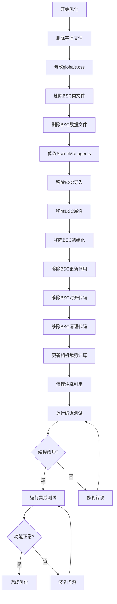
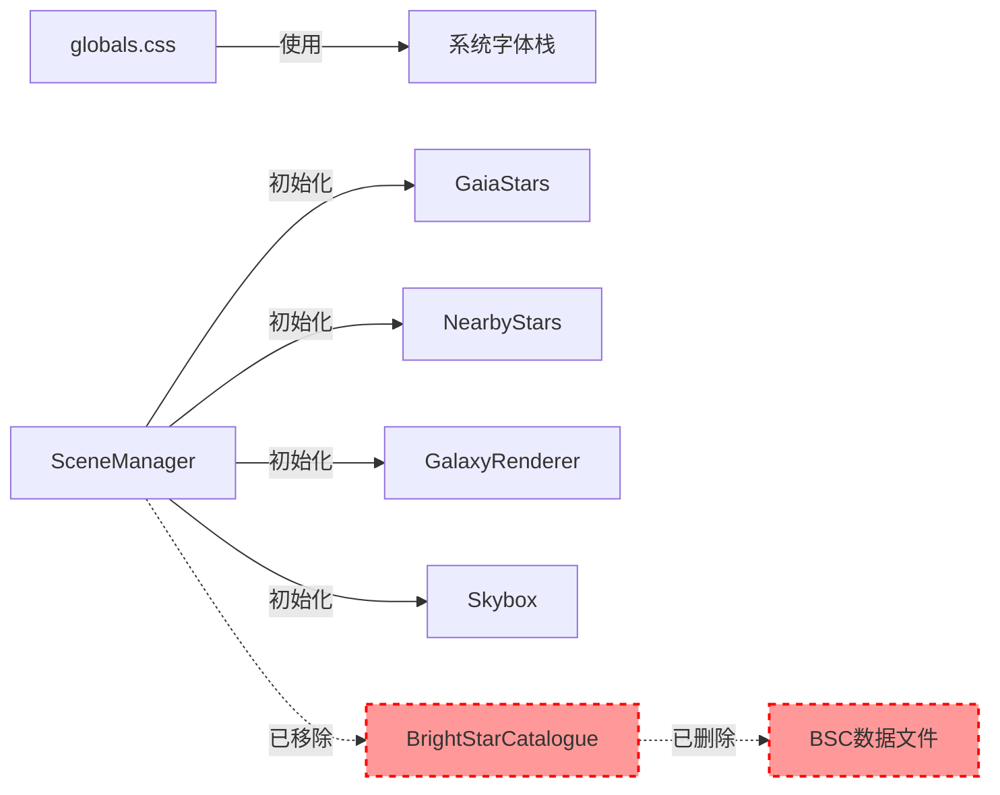

# Design Document: Performance Optimization

## Overview

本设计文档描述了网页加载速度优化功能的技术实现方案。该优化通过两个主要措施来减少页面初始加载时间：

1. **字体优化**：移除约1.5MB的自定义字体文件，改用系统字体栈
2. **移除Bright Star Catalogue**：删除BSC数据文件（约200KB）和相关渲染代码

这些优化预计可减少约1.7MB的初始加载资源，显著提升首次访问速度，同时保持应用的核心功能完整。

## Architecture

### 当前架构

```
src/app/
  └── globals.css                    # 全局样式，包含@font-face声明
  
src/lib/3d/
  ├── SceneManager.ts                # 场景管理器，初始化所有星图系统
  ├── BrightStarCatalogue.ts         # BSC渲染器（将被删除）
  ├── GaiaStars.ts                   # Gaia星图（保留）
  ├── NearbyStars.ts                 # 近邻恒星（保留）
  └── GalaxyRenderer.ts              # 银河系渲染器（保留）

public/
  ├── fonts/
  │   └── SourceHanSerifCN-VF.otf.woff2  # 自定义字体（将被删除）
  └── data/
      └── V_50/
          └── catalog/
              └── catalog            # BSC数据文件（将被删除）
```

### 优化后架构

```
src/app/
  └── globals.css                    # 使用系统字体栈
  
src/lib/3d/
  ├── SceneManager.ts                # 移除BSC相关代码
  ├── GaiaStars.ts                   # 保留
  ├── NearbyStars.ts                 # 保留
  └── GalaxyRenderer.ts              # 保留

public/
  └── data/
      └── gaia/                      # 保留Gaia数据
```

## Components and Interfaces

### 1. 字体系统

#### 当前实现

**globals.css**:
```css
@font-face {
  font-family: 'SourceHanSerifCN';
  src: url('/fonts/SourceHanSerifCN-VF.otf.woff2') format('woff2-variations');
  font-weight: 100 900;
  font-style: normal;
  font-display: swap;
}

body {
  font-family: 'SourceHanSerifCN', system-ui, -apple-system, ...;
}

.font-mono {
  font-family: 'SourceHanSerifCN', system-ui, -apple-system, ...;
}
```

#### 优化后实现

**globals.css**:
```css
/* 移除@font-face声明 */

body {
  font-family: 'Source Han Serif CN', 'SimSun', serif, system-ui, -apple-system, BlinkMacSystemFont, 'Segoe UI', sans-serif;
}

.font-mono {
  font-family: 'Source Han Serif CN', 'SimSun', serif, system-ui, -apple-system, BlinkMacSystemFont, 'Segoe UI', sans-serif;
}
```

**字体栈说明**:
- `'Source Han Serif CN'`: 系统安装的思源宋体（优先）
- `'SimSun'`: Windows系统宋体（备选）
- `serif`: 通用衬线字体（备选）
- `system-ui, -apple-system, BlinkMacSystemFont, 'Segoe UI', sans-serif`: 系统默认字体（最终备选）

### 2. Bright Star Catalogue系统

#### 当前实现

**BrightStarCatalogue.ts**:
- 类：`BrightStarCatalogue`
- 配置：`BSC_CONFIG`
- 功能：
  - 加载并解析BSC数据文件（`/data/V_50/catalog/catalog`）
  - 创建恒星点云渲染
  - 创建星名标签精灵
  - 根据相机距离动态显示/隐藏
  - 应用赤道坐标系到黄道坐标系的旋转对齐

**SceneManager.ts中的集成**:
```typescript
import { BrightStarCatalogue, BSC_CONFIG } from './BrightStarCatalogue';

export class SceneManager {
  private brightStarCatalogue: BrightStarCatalogue | null = null;
  
  private initializeMultiScaleView(): void {
    if (BSC_CONFIG.enabled) {
      this.brightStarCatalogue = new BrightStarCatalogue();
      this.scene.add(this.brightStarCatalogue.getGroup());
    }
  }
  
  private applyStarsAlignment(): void {
    if (this.brightStarCatalogue) {
      this.brightStarCatalogue.getGroup().quaternion.copy(combinedExtraQuat);
    }
  }
  
  updateMultiScaleView(cameraDistance: number, deltaTime: number, starBrightness: number = 1.0): void {
    if (this.brightStarCatalogue) {
      this.brightStarCatalogue.update(cameraDistance, deltaTime);
    }
  }
  
  updateCameraClipping(currentObjectRadius: number, distanceToSun: number): void {
    const minFar = BSC_CONFIG.sphereRadius * 2;
    const far = Math.max(minFar, ...);
    this.camera.far = far;
  }
  
  dispose(): void {
    if (this.brightStarCatalogue) {
      this.brightStarCatalogue.dispose();
      this.brightStarCatalogue = null;
    }
  }
}
```

#### 优化后实现

**删除文件**:
- `src/lib/3d/BrightStarCatalogue.ts`
- `public/data/V_50/catalog/catalog`
- `public/data/V_50/` 整个目录（包括notes和ReadMe）

**SceneManager.ts修改**:
```typescript
// 移除导入
// import { BrightStarCatalogue, BSC_CONFIG } from './BrightStarCatalogue';

export class SceneManager {
  // 移除属性
  // private brightStarCatalogue: BrightStarCatalogue | null = null;
  
  private initializeMultiScaleView(): void {
    // 移除BSC初始化代码
  }
  
  private applyStarsAlignment(): void {
    // 移除BSC对齐代码
  }
  
  updateMultiScaleView(cameraDistance: number, deltaTime: number, starBrightness: number = 1.0): void {
    // 移除BSC更新代码
  }
  
  updateCameraClipping(currentObjectRadius: number, distanceToSun: number): void {
    // 移除BSC_CONFIG引用，使用固定值或其他配置
    const minFar = 1e6; // 使用固定的大值
    const far = Math.max(minFar, ...);
    this.camera.far = far;
  }
  
  dispose(): void {
    // 移除BSC清理代码
  }
}
```

### 3. 保留的星图系统

以下系统保持不变：

- **GaiaStars**: Gaia DR3星表渲染器
- **NearbyStars**: 近邻恒星渲染器
- **GalaxyRenderer**: 银河系粒子渲染器
- **Skybox**: 银河系背景天空盒

## Data Models

### 字体配置

```typescript
// 无需数据模型，直接在CSS中定义字体栈
```

### BSC配置（删除）

```typescript
// 以下配置将被完全删除
export const BSC_CONFIG = {
  enabled: true,
  dataPath: '/data/V_50/catalog/catalog',
  sphereRadius: 500000,
  fadeStart: 63241,
  fadeEnd: 126482,
  // ...其他配置
};
```

## Correctness Properties

*属性是一个特征或行为，应该在系统的所有有效执行中保持为真——本质上是关于系统应该做什么的形式化陈述。属性作为人类可读规范和机器可验证正确性保证之间的桥梁。*


### Property Reflection

经过分析acceptance criteria，我发现本次优化主要涉及：
1. 文件删除操作（字体文件、BSC类文件、数据文件）
2. 代码修改操作（移除导入、属性、方法调用）
3. CSS修改操作（移除@font-face、更新font-family）

这些都是具体的重构操作，而不是跨多个输入的通用属性。大多数验证都是"例子"类型的测试（验证特定文件或代码片段的状态）。

可以合并的验证：
- 2.3-2.9 可以合并为一个综合属性：SceneManager中不包含任何BSC相关引用
- 4.1-4.2 可以合并为一个属性：代码中不包含BSC相关注释
- 4.3-4.5 可以合并为一个属性：代码可以无错误编译

### Correctness Properties

**Property 1: 字体文件已移除**
*For any* 文件系统检查，字体文件 `public/fonts/SourceHanSerifCN-VF.otf.woff2` 应该不存在
**Validates: Requirements 1.1**

**Property 2: CSS使用系统字体栈**
*For any* CSS规则中的 `font-family` 声明，应该使用系统字体栈而不是自定义字体 'SourceHanSerifCN'
**Validates: Requirements 1.2, 1.3, 1.4, 1.5**

**Property 3: BSC文件已完全移除**
*For any* 文件系统检查，以下文件应该不存在：
- `src/lib/3d/BrightStarCatalogue.ts`
- `public/data/V_50/` 目录及其所有内容
**Validates: Requirements 2.1, 2.2**

**Property 4: SceneManager不包含BSC引用**
*For any* 对 `SceneManager.ts` 的代码分析，应该不包含以下任何引用：
- `BrightStarCatalogue` 导入
- `BSC_CONFIG` 导入
- `brightStarCatalogue` 属性
- `BrightStarCatalogue` 的实例化、更新、对齐或清理代码
**Validates: Requirements 2.3, 2.4, 2.5, 2.6, 2.7, 2.8, 2.9**

**Property 5: 代码中无BSC注释引用**
*For any* 代码文件中的注释，应该不包含 `BrightStarCatalogue` 或 `BSC_CONFIG` 的引用（除非是历史记录或文档说明）
**Validates: Requirements 4.1, 4.2**

**Property 6: 代码无编译错误**
*For any* TypeScript编译过程，应该成功完成且不产生与已删除功能相关的错误或警告
**Validates: Requirements 4.3, 4.4, 4.5**

## Error Handling

### 字体回退机制

当系统字体不可用时，浏览器会按照字体栈的顺序自动回退：

1. 尝试 `'Source Han Serif CN'`（系统安装的思源宋体）
2. 回退到 `'SimSun'`（Windows宋体）
3. 回退到 `serif`（通用衬线字体）
4. 最终回退到 `system-ui` 等系统默认字体

这是浏览器的原生行为，无需额外的错误处理代码。

### 代码重构错误处理

在移除BSC相关代码时，需要注意：

1. **编译时错误**：
   - 使用TypeScript编译器检测未定义的引用
   - 使用ESLint检测未使用的导入
   - 在开发环境中及时发现并修复错误

2. **运行时错误**：
   - 确保移除代码后不会导致空指针异常
   - 确保相机裁剪平面的计算不依赖BSC_CONFIG
   - 使用固定值替代BSC_CONFIG.sphereRadius

3. **回归测试**：
   - 验证其他星图系统（GaiaStars、NearbyStars、GalaxyRenderer）仍然正常工作
   - 验证场景初始化、更新和清理流程完整

## Testing Strategy

### 测试方法

本次优化主要涉及代码重构和文件删除，测试策略包括：

1. **单元测试**：验证具体的文件和代码状态
2. **集成测试**：验证应用整体功能正常
3. **手动测试**：验证视觉效果和性能改进

### 单元测试

**文件系统测试**：
- 验证字体文件已删除
- 验证BSC类文件已删除
- 验证BSC数据文件已删除

**代码分析测试**：
- 解析CSS文件，验证@font-face已移除
- 解析CSS文件，验证font-family使用系统字体栈
- 解析TypeScript文件，验证BSC导入已移除
- 解析TypeScript文件，验证BSC属性和方法调用已移除

**编译测试**：
- 运行TypeScript编译器，验证无错误
- 运行ESLint，验证无未使用的导入

### 集成测试

**功能完整性测试**：
- 启动应用，验证页面正常加载
- 验证GaiaStars正常显示
- 验证NearbyStars正常显示
- 验证GalaxyRenderer正常显示
- 验证太阳系天体正常显示
- 验证相机控制正常工作
- 验证时间控制正常工作

**性能测试**：
- 测量页面初始加载时间
- 测量网络请求大小
- 验证不再请求字体文件和BSC数据文件

### 手动测试

**视觉验证**：
- 检查字体显示效果（中文和英文）
- 检查不同操作系统下的字体回退
- 检查星空显示效果（确认BSC移除后仍有足够的星星）

**性能验证**：
- 使用浏览器开发者工具监控网络请求
- 对比优化前后的加载时间
- 验证首次访问和后续访问的性能

### 测试配置

**属性测试配置**：
- 本次优化不需要property-based testing（因为都是具体的例子测试）
- 使用Jest进行单元测试
- 使用文件系统API验证文件状态
- 使用TypeScript Compiler API或正则表达式解析代码

**测试标签**：
每个测试应该标注其验证的需求：
```typescript
// Feature: performance-optimization, Property 1: 字体文件已移除
test('font file should be removed', () => {
  // ...
});

// Feature: performance-optimization, Property 4: SceneManager不包含BSC引用
test('SceneManager should not contain BSC references', () => {
  // ...
});
```

## Implementation Notes

### 字体优化注意事项

1. **字体名称**：
   - 使用 `'Source Han Serif CN'` 而不是 `'SourceHanSerifCN'`
   - 系统字体名称通常包含空格

2. **字体权重**：
   - 系统字体可能不支持可变字重（100-900）
   - 使用CSS变量定义的字重值应该在系统字体支持的范围内
   - 常见支持：400（normal）、700（bold）

3. **跨平台兼容性**：
   - macOS：可能有 Source Han Serif CN
   - Windows：通常有 SimSun（宋体）
   - Linux：字体支持差异较大，依赖系统安装
   - 最终回退到 serif 和 system-ui 确保基本可用性

### BSC移除注意事项

1. **相机裁剪平面**：
   - 原代码使用 `BSC_CONFIG.sphereRadius * 2` 计算 minFar
   - 移除后使用固定值 `1e6`（100万AU）
   - 这个值足够大，可以覆盖所有保留的星图系统

2. **星空对齐**：
   - `applyStarsAlignment()` 方法中移除BSC的四元数应用
   - 保留GaiaStars和NearbyStars的对齐代码
   - 保留skybox的对齐代码

3. **注释清理**：
   - 移除代码中提到BSC的注释
   - 更新文档字符串，不再提及BSC
   - 保留历史记录中的BSC引用（如git commit message）

4. **依赖清理**：
   - 确保没有其他文件导入BrightStarCatalogue
   - 使用全局搜索确认所有引用已移除

### 性能预期

**优化前**：
- 字体文件：~1.5MB
- BSC数据文件：~200KB
- 总计：~1.7MB

**优化后**：
- 字体文件：0KB（使用系统字体）
- BSC数据文件：0KB（已删除）
- 节省：~1.7MB

**预期效果**：
- 首次访问加载时间减少 30-50%（取决于网络速度）
- 后续访问不受影响（原本就有缓存）
- 字体渲染时间减少（无需等待字体下载）

## Diagrams

### 优化流程图



### 代码依赖关系



## References

- [思源宋体 (Source Han Serif)](https://github.com/adobe-fonts/source-han-serif)
- [CSS font-family 属性](https://developer.mozilla.org/en-US/docs/Web/CSS/font-family)
- [Three.js 文档](https://threejs.org/docs/)
- [Bright Star Catalogue](https://cdsarc.cds.unistra.fr/viz-bin/cat/V/50)
