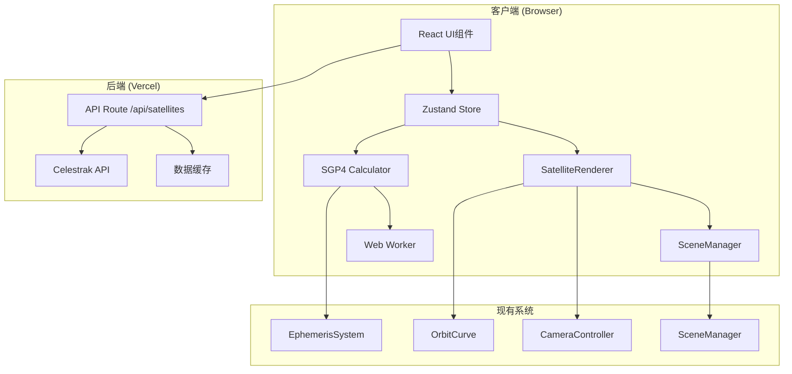
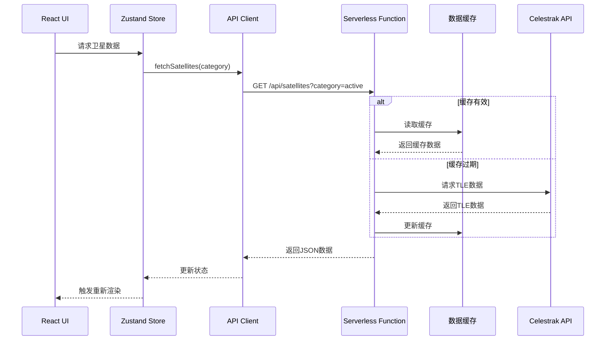
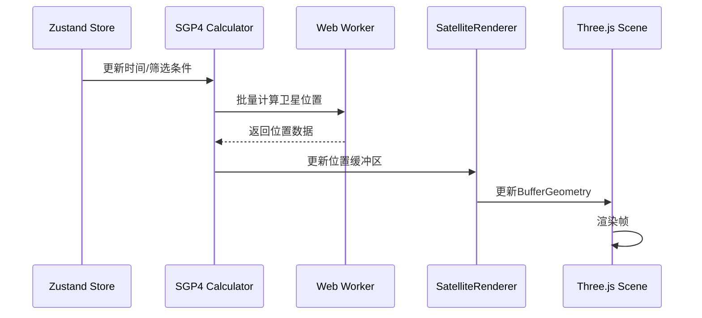
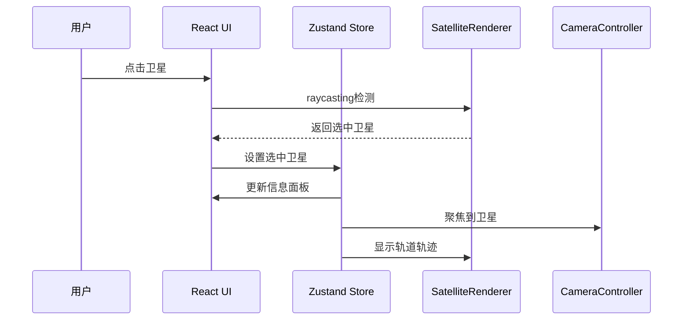

# 设计文档 - 地球卫星实时可视化系统

## 概述

地球卫星实时可视化系统是一个高性能的Web 3D应用,用于实时显示和跟踪地球轨道上的数万颗卫星。系统采用前后端分离架构,后端使用Vercel Serverless Functions获取和缓存Celestrak TLE数据,前端使用Three.js进行高性能点云渲染,并与现有太阳系可视化系统无缝集成。

### 核心技术选型

- **前端框架**: Next.js 16 (App Router) + React 19
- **3D渲染**: Three.js 0.170
- **轨道计算**: satellite.js (SGP4算法实现)
- **状态管理**: Zustand 5
- **后端**: Vercel Serverless Functions
- **类型系统**: TypeScript 5
- **并发计算**: Web Worker

### 设计目标

1. **高性能**: 支持50,000+颗卫星的实时渲染,保持60fps
2. **可扩展**: 模块化架构,支持未来功能扩展
3. **可维护**: 清晰的代码组织,完整的类型定义
4. **用户体验**: 流畅的交互,友好的错误处理
5. **集成性**: 与现有太阳系系统无缝集成

## 架构设计

### 系统架构图



### 分层架构

系统采用四层架构设计:

1. **表现层 (Presentation Layer)**
   - React UI组件
   - 用户交互处理
   - 状态展示

2. **业务逻辑层 (Business Logic Layer)**
   - Zustand状态管理
   - 卫星数据处理
   - 筛选和搜索逻辑

3. **计算层 (Computation Layer)**
   - SGP4轨道计算
   - 坐标系转换
   - Web Worker并发计算

4. **渲染层 (Rendering Layer)**
   - Three.js场景管理
   - 点云渲染
   - 轨道轨迹渲染

5. **数据层 (Data Layer)**
   - API客户端
   - 数据缓存
   - Serverless Functions

## 数据流设计

### 数据获取流程



### 渲染更新流程



### 交互流程



## 核心模块设计

### 1. 后端模块 - Serverless Functions

#### 1.1 API Route Handler

**文件**: `app/api/satellites/route.ts`

```typescript
// API端点设计
export async function GET(request: Request) {
  const { searchParams } = new URL(request.url);
  const category = searchParams.get('category') || 'active';
  
  // 速率限制检查
  // 缓存检查
  // 数据获取
  // 返回响应
}
```

**职责**:
- 处理HTTP请求
- 实现速率限制
- 管理数据缓存
- 错误处理

**缓存策略**:
- 使用Vercel KV或内存缓存
- 缓存时间: 2小时
- 缓存键: `satellites:${category}:${timestamp}`
- 包含Last-Modified头

#### 1.2 Celestrak数据获取器

**文件**: `lib/server/celestrakClient.ts`

```typescript
interface CelestrakClient {
  fetchTLE(category: SatelliteCategory): Promise<TLEData[]>;
  parseTLE(rawData: string): TLEData[];
  validateTLE(tle: TLEData): boolean;
}
```

**职责**:
- 从Celestrak API获取TLE数据
- 解析TLE格式
- 验证数据有效性
- 错误重试机制

**支持的类别**:
- `active`: 活跃卫星
- `stations`: 国际空间站
- `gps-ops`: GPS卫星
- `geo`: 地球同步轨道卫星
- `weather`: 气象卫星
- `science`: 科学卫星

### 2. 数据模型层

#### 2.1 核心数据结构

**文件**: `lib/types/satellite.ts`

```typescript
// TLE数据结构
interface TLEData {
  name: string;
  noradId: number;
  line1: string;  // TLE第一行
  line2: string;  // TLE第二行
  category: SatelliteCategory;
  epoch: Date;    // 历元时间
}

// 卫星轨道参数
interface OrbitalElements {
  inclination: number;      // 倾角(度)
  eccentricity: number;     // 偏心率
  meanMotion: number;       // 平均运动(圈/天)
  semiMajorAxis: number;    // 半长轴(km)
  period: number;           // 轨道周期(分钟)
  apogee: number;           // 远地点(km)
  perigee: number;          // 近地点(km)
}

// 卫星实时状态
interface SatelliteState {
  noradId: number;
  name: string;
  position: Vector3;        // Three.js坐标系位置
  velocity: Vector3;        // 速度向量
  altitude: number;         // 轨道高度(km)
  orbitType: OrbitType;     // LEO/MEO/GEO
  category: SatelliteCategory;
  orbitalElements: OrbitalElements;
  lastUpdate: number;       // 时间戳
}

// 轨道类型
enum OrbitType {
  LEO = 'LEO',    // 低地球轨道 (<2000km)
  MEO = 'MEO',    // 中地球轨道 (2000-35786km)
  GEO = 'GEO',    // 地球同步轨道 (~35786km)
  HEO = 'HEO'     // 高椭圆轨道
}

// 卫星类别
enum SatelliteCategory {
  ACTIVE = 'active',
  ISS = 'stations',
  GPS = 'gps-ops',
  COMMUNICATION = 'geo',
  WEATHER = 'weather',
  SCIENCE = 'science',
  OTHER = 'other'
}
```

#### 2.2 API响应格式

```typescript
interface SatelliteAPIResponse {
  satellites: TLEData[];
  count: number;
  category: string;
  lastUpdate: string;      // ISO 8601格式
  cacheExpiry: string;     // ISO 8601格式
}
```

### 3. 计算层 - SGP4引擎

#### 3.1 SGP4计算器

**文件**: `lib/satellite/sgp4Calculator.ts`

```typescript
class SGP4Calculator {
  private worker: Worker;
  private tleCache: Map<number, SatelliteRecord>;
  
  constructor() {
    // 初始化Web Worker
    this.worker = new Worker('/workers/sgp4.worker.js');
  }
  
  // 批量计算卫星位置
  async calculatePositions(
    noradIds: number[],
    julianDate: number
  ): Promise<Map<number, SatelliteState>> {
    // 分批发送到Worker
    // 等待计算结果
    // 转换坐标系
    // 返回结果
  }
  
  // 计算单颗卫星轨道轨迹
  async calculateOrbit(
    noradId: number,
    startTime: number,
    duration: number,
    steps: number
  ): Promise<Vector3[]> {
    // 计算轨道周期内的位置点
  }
  
  // ECI到Three.js坐标系转换
  private eciToThreeJS(eciPos: ECIPosition): Vector3 {
    // ECI: Z轴指向北极, X轴指向春分点
    // Three.js: Y轴向上, Z轴指向观察者
    // 转换: (X, Y, Z)_ECI -> (X, Z, -Y)_Three / 1000
  }
}
```

**坐标系转换**:
- ECI坐标系: 地心惯性坐标系,单位km
- Three.js坐标系: Y轴向上,单位为1000km
- 转换公式: `(x, y, z)_Three = (x_ECI, z_ECI, -y_ECI) / 1000`

#### 3.2 Web Worker实现

**文件**: `public/workers/sgp4.worker.js`

```typescript
// Worker消息接口
interface WorkerMessage {
  type: 'calculate' | 'orbit';
  payload: {
    tles: TLEData[];
    julianDate: number;
    steps?: number;
  };
}

interface WorkerResponse {
  type: 'result' | 'error';
  payload: {
    positions: ECIPosition[];
    errors?: string[];
  };
}

// Worker主循环
self.onmessage = (e: MessageEvent<WorkerMessage>) => {
  const { type, payload } = e.data;
  
  if (type === 'calculate') {
    // 使用satellite.js计算位置
    const results = payload.tles.map(tle => {
      const satrec = satellite.twoline2satrec(tle.line1, tle.line2);
      const positionAndVelocity = satellite.propagate(
        satrec,
        payload.julianDate
      );
      return positionAndVelocity;
    });
    
    self.postMessage({ type: 'result', payload: { positions: results } });
  }
};
```

**性能优化**:
- 每帧最多计算1000颗卫星
- 使用对象池复用计算对象
- 缓存SGP4 satrec对象
- 分批处理避免阻塞

### 4. 渲染层 - 卫星渲染器

#### 4.1 SatelliteRenderer类

**文件**: `lib/three/SatelliteRenderer.ts`

```typescript
class SatelliteRenderer {
  private scene: THREE.Scene;
  private pointCloud: THREE.Points;
  private geometry: THREE.BufferGeometry;
  private material: THREE.PointsMaterial;
  private positionBuffer: Float32Array;
  private colorBuffer: Float32Array;
  private sizeBuffer: Float32Array;
  private satellites: Map<number, SatelliteState>;
  private selectedSatellite: number | null;
  private orbitCurves: Map<number, OrbitCurve>;
  
  constructor(sceneManager: SceneManager) {
    this.scene = sceneManager.getScene();
    this.initPointCloud();
  }
  
  // 初始化点云
  private initPointCloud(): void {
    // 创建BufferGeometry
    this.geometry = new THREE.BufferGeometry();
    
    // 创建缓冲区
    this.positionBuffer = new Float32Array(MAX_SATELLITES * 3);
    this.colorBuffer = new Float32Array(MAX_SATELLITES * 3);
    this.sizeBuffer = new Float32Array(MAX_SATELLITES);
    
    // 设置属性
    this.geometry.setAttribute(
      'position',
      new THREE.BufferAttribute(this.positionBuffer, 3)
    );
    this.geometry.setAttribute(
      'color',
      new THREE.BufferAttribute(this.colorBuffer, 3)
    );
    this.geometry.setAttribute(
      'size',
      new THREE.BufferAttribute(this.sizeBuffer, 1)
    );
    
    // 创建材质
    this.material = new THREE.PointsMaterial({
      size: 0.05,
      vertexColors: true,
      sizeAttenuation: true,
      transparent: true,
      opacity: 0.8
    });
    
    // 创建点云对象
    this.pointCloud = new THREE.Points(this.geometry, this.material);
    this.scene.add(this.pointCloud);
  }
  
  // 更新卫星位置
  updatePositions(satellites: Map<number, SatelliteState>): void {
    this.satellites = satellites;
    let index = 0;
    
    satellites.forEach((sat) => {
      // 更新位置
      this.positionBuffer[index * 3] = sat.position.x;
      this.positionBuffer[index * 3 + 1] = sat.position.y;
      this.positionBuffer[index * 3 + 2] = sat.position.z;
      
      // 更新颜色(根据轨道类型)
      const color = this.getColorByOrbitType(sat.orbitType);
      this.colorBuffer[index * 3] = color.r;
      this.colorBuffer[index * 3 + 1] = color.g;
      this.colorBuffer[index * 3 + 2] = color.b;
      
      // 更新大小(LOD)
      this.sizeBuffer[index] = this.calculatePointSize(sat.position);
      
      index++;
    });
    
    // 标记需要更新
    this.geometry.attributes.position.needsUpdate = true;
    this.geometry.attributes.color.needsUpdate = true;
    this.geometry.attributes.size.needsUpdate = true;
    
    // 更新包围盒
    this.geometry.computeBoundingSphere();
  }
  
  // 根据轨道类型获取颜色
  private getColorByOrbitType(orbitType: OrbitType): THREE.Color {
    switch (orbitType) {
      case OrbitType.LEO:
        return new THREE.Color(0x00aaff); // 蓝色
      case OrbitType.MEO:
        return new THREE.Color(0x00ff00); // 绿色
      case OrbitType.GEO:
        return new THREE.Color(0xff0000); // 红色
      default:
        return new THREE.Color(0xffffff); // 白色
    }
  }
  
  // 计算点大小(LOD)
  private calculatePointSize(position: THREE.Vector3): number {
    const camera = this.scene.userData.camera;
    const distance = camera.position.distanceTo(position);
    
    // 距离越远,点越小
    if (distance < 10) return 0.1;
    if (distance < 50) return 0.05;
    return 0.02;
  }
  
  // 射线投射检测点击
  raycas
t(raycaster: THREE.Raycaster): number | null {
    const intersects = raycaster.intersectObject(this.pointCloud);
    
    if (intersects.length > 0) {
      const index = intersects[0].index;
      // 从索引获取NORAD ID
      const noradId = Array.from(this.satellites.keys())[index];
      return noradId;
    }
    
    return null;
  }
  
  // 显示卫星轨道
  async showOrbit(noradId: number, calculator: SGP4Calculator): Promise<void> {
    if (this.orbitCurves.has(noradId)) {
      return; // 已经显示
    }
    
    // 限制最多10条轨道
    if (this.orbitCurves.size >= 10) {
      const firstKey = this.orbitCurves.keys().next().value;
      this.hideOrbit(firstKey);
    }
    
    const satellite = this.satellites.get(noradId);
    if (!satellite) return;
    
    // 计算轨道轨迹
    const period = satellite.orbitalElements.period * 60; // 转换为秒
    const points = await calculator.calculateOrbit(
      noradId,
      Date.now(),
      period,
      100 // 100个点
    );
    
    // 创建轨道曲线
    const color = this.getColorByOrbitType(satellite.orbitType);
    const orbitCurve = new OrbitCurve(points, color, 0.01);
    this.orbitCurves.set(noradId, orbitCurve);
    this.scene.add(orbitCurve.getMesh());
  }
  
  // 隐藏卫星轨道
  hideOrbit(noradId: number): void {
    const orbitCurve = this.orbitCurves.get(noradId);
    if (orbitCurve) {
      this.scene.remove(orbitCurve.getMesh());
      orbitCurve.dispose();
      this.orbitCurves.delete(noradId);
    }
  }
  
  // 清理资源
  dispose(): void {
    this.geometry.dispose();
    this.material.dispose();
    this.scene.remove(this.pointCloud);
    
    this.orbitCurves.forEach((curve) => {
      this.scene.remove(curve.getMesh());
      curve.dispose();
    });
    this.orbitCurves.clear();
  }
}
```

**渲染优化策略**:
1. **BufferGeometry**: 使用TypedArray直接操作GPU缓冲区
2. **视锥剔除**: Three.js自动实现,通过BoundingSphere优化
3. **LOD**: 根据相机距离动态调整点大小
4. **批量更新**: 一次性更新所有属性,减少GPU通信
5. **对象池**: 复用OrbitCurve对象

#### 4.2 与现有系统集成

**文件**: `lib/three/SatelliteLayer.ts`

```typescript
class SatelliteLayer {
  private sceneManager: SceneManager;
  private renderer: SatelliteRenderer;
  private calculator: SGP4Calculator;
  private ephemerisSystem: EphemerisSystem;
  private visible: boolean = true;
  
  constructor(
    sceneManager: SceneManager,
    ephemerisSystem: EphemerisSystem
  ) {
    this.sceneManager = sceneManager;
    this.ephemerisSystem = ephemerisSystem;
    this.renderer = new SatelliteRenderer(sceneManager);
    this.calculator = new SGP4Calculator();
    
    // 注册到场景管理器
    sceneManager.registerLayer('satellites', this);
  }
  
  // 每帧更新
  update(): void {
    if (!this.visible) return;
    
    // 从星历系统获取当前时间
    const currentTime = this.ephemerisSystem.getCurrentTime();
    const julianDate = this.timeToJulianDate(currentTime);
    
    // 获取可见卫星列表
    const visibleSatellites = this.getVisibleSatellites();
    
    // 计算位置
    this.calculator.calculatePositions(visibleSatellites, julianDate)
      .then((positions) => {
        this.renderer.updatePositions(positions);
      });
  }
  
  // 设置可见性
  setVisible(visible: boolean): void {
    this.visible = visible;
    this.renderer.setVisible(visible);
  }
  
  // 清理资源
  dispose(): void {
    this.renderer.dispose();
    this.calculator.dispose();
    this.sceneManager.unregisterLayer('satellites');
  }
}
```

### 5. 状态管理 - Zustand Store

#### 5.1 卫星状态Store

**文件**: `lib/store/useSatelliteStore.ts`

```typescript
interface SatelliteStore {
  // 数据状态
  tleData: Map<number, TLEData>;
  satellites: Map<number, SatelliteState>;
  loading: boolean;
  error: string | null;
  lastUpdate: Date | null;
  
  // 筛选状态
  selectedCategories: Set<SatelliteCategory>;
  searchQuery: string;
  visibleSatellites: Set<number>;
  
  // 交互状态
  selectedSatellite: number | null;
  hoveredSatellite: number | null;
  showOrbits: Set<number>;
  
  // UI状态
  showSatellites: boolean;
  showInfoPanel: boolean;
  
  // Actions
  fetchSatellites: (category?: SatelliteCategory) => Promise<void>;
  updateSatellitePositions: (time: number) => void;
  setSelectedCategories: (categories: Set<SatelliteCategory>) => void;
  setSearchQuery: (query: string) => void;
  selectSatellite: (noradId: number | null) => void;
  toggleOrbit: (noradId: number) => void;
  clearAllOrbits: () => void;
  setShowSatellites: (show: boolean) => void;
}

const useSatelliteStore = create<SatelliteStore>((set, get) => ({
  // 初始状态
  tleData: new Map(),
  satellites: new Map(),
  loading: false,
  error: null,
  lastUpdate: null,
  selectedCategories: new Set([SatelliteCategory.ACTIVE]),
  searchQuery: '',
  visibleSatellites: new Set(),
  selectedSatellite: null,
  hoveredSatellite: null,
  showOrbits: new Set(),
  showSatellites: true,
  showInfoPanel: false,
  
  // 获取卫星数据
  fetchSatellites: async (category) => {
    set({ loading: true, error: null });
    
    try {
      const response = await fetch(
        `/api/satellites?category=${category || 'active'}`
      );
      
      if (!response.ok) {
        throw new Error('Failed to fetch satellites');
      }
      
      const data: SatelliteAPIResponse = await response.json();
      
      // 转换为Map
      const tleMap = new Map(
        data.satellites.map(tle => [tle.noradId, tle])
      );
      
      set({
        tleData: tleMap,
        lastUpdate: new Date(data.lastUpdate),
        loading: false
      });
      
      // 触发位置计算
      get().updateSatellitePositions(Date.now());
      
    } catch (error) {
      set({
        error: error.message,
        loading: false
      });
    }
  },
  
  // 更新卫星位置
  updateSatellitePositions: (time: number) => {
    const { tleData, selectedCategories, searchQuery } = get();
    
    // 筛选可见卫星
    const visible = new Set<number>();
    tleData.forEach((tle, noradId) => {
      if (selectedCategories.has(tle.category)) {
        if (!searchQuery || 
            tle.name.toLowerCase().includes(searchQuery.toLowerCase()) ||
            noradId.toString().includes(searchQuery)) {
          visible.add(noradId);
        }
      }
    });
    
    set({ visibleSatellites: visible });
  },
  
  // 设置选中类别
  setSelectedCategories: (categories) => {
    set({ selectedCategories: categories });
    get().updateSatellitePositions(Date.now());
  },
  
  // 设置搜索查询
  setSearchQuery: (query) => {
    set({ searchQuery: query });
    get().updateSatellitePositions(Date.now());
  },
  
  // 选择卫星
  selectSatellite: (noradId) => {
    set({
      selectedSatellite: noradId,
      showInfoPanel: noradId !== null
    });
  },
  
  // 切换轨道显示
  toggleOrbit: (noradId) => {
    const { showOrbits } = get();
    const newOrbits = new Set(showOrbits);
    
    if (newOrbits.has(noradId)) {
      newOrbits.delete(noradId);
    } else {
      // 限制最多10条
      if (newOrbits.size >= 10) {
        const first = newOrbits.values().next().value;
        newOrbits.delete(first);
      }
      newOrbits.add(noradId);
    }
    
    set({ showOrbits: newOrbits });
  },
  
  // 清除所有轨道
  clearAllOrbits: () => {
    set({ showOrbits: new Set() });
  },
  
  // 设置卫星可见性
  setShowSatellites: (show) => {
    set({ showSatellites: show });
  }
}));

export default useSatelliteStore;
```

#### 5.2 与现有Store集成

```typescript
// 在现有的useSolarSystemStore中添加卫星相关状态
interface SolarSystemStore {
  // ... 现有状态
  
  // 卫星图层
  satelliteLayerEnabled: boolean;
  setSatelliteLayerEnabled: (enabled: boolean) => void;
}
```

### 6. UI组件设计

#### 6.1 组件层次结构

```
SatelliteVisualization (容器组件)
├── SatelliteControls (控制面板)
│   ├── CategoryFilter (类别筛选器)
│   ├── SearchBar (搜索栏)
│   ├── VisibilityToggle (可见性开关)
│   └── DataStatus (数据状态显示)
├── SatelliteInfoPanel (信息面板)
│   ├── SatelliteDetails (卫星详情)
│   ├── OrbitParameters (轨道参数)
│   └── OrbitControls (轨道控制)
└── SatelliteStats (统计信息)
```

#### 6.2 核心组件实现

**SatelliteControls组件**

**文件**: `components/satellite/SatelliteControls.tsx`

```typescript
export function SatelliteControls() {
  const {
    selectedCategories,
    searchQuery,
    showSatellites,
    visibleSatellites,
    lastUpdate,
    loading,
    setSelectedCategories,
    setSearchQuery,
    setShowSatellites,
    fetchSatellites
  } = useSatelliteStore();
  
  return (
    <div className="satellite-controls">
      {/* 类别筛选 */}
      <CategoryFilter
        selected={selectedCategories}
        onChange={setSelectedCategories}
      />
      
      {/* 搜索栏 */}
      <SearchBar
        value={searchQuery}
        onChange={setSearchQuery}
        placeholder="搜索卫星名称或NORAD ID..."
      />
      
      {/* 可见性开关 */}
      <VisibilityToggle
        checked={showSatellites}
        onChange={setShowSatellites}
        label="显示卫星"
      />
      
      {/* 数据状态 */}
      <DataStatus
        lastUpdate={lastUpdate}
        loading={loading}
        count={visibleSatellites.size}
        onRefresh={() => fetchSatellites()}
      />
    </div>
  );
}
```

**SatelliteInfoPanel组件**

**文件**: `components/satellite/SatelliteInfoPanel.tsx`

```typescript
export function SatelliteInfoPanel() {
  const {
    selectedSatellite,
    satellites,
    showOrbits,
    selectSatellite,
    toggleOrbit
  } = useSatelliteStore();
  
  if (!selectedSatellite) return null;
  
  const satellite = satellites.get(selectedSatellite);
  if (!satellite) return null;
  
  return (
    <div className="satellite-info-panel">
      <div className="panel-header">
        <h3>{satellite.name}</h3>
        <button onClick={() => selectSatellite(null)}>×</button>
      </div>
      
      <div className="panel-content">
        {/* 基本信息 */}
        <div className="info-section">
          <h4>基本信息</h4>
          <div className="info-item">
            <span>NORAD ID:</span>
            <span>{satellite.noradId}</span>
          </div>
          <div className="info-item">
            <span>类别:</span>
            <span>{satellite.category}</span>
          </div>
          <div className="info-item">
            <span>轨道类型:</span>
            <span>{satellite.orbitType}</span>
          </div>
        </div>
        
        {/* 轨道参数 */}
        <div className="info-section">
          <h4>轨道参数</h4>
          <div className="info-item">
            <span>高度:</span>
            <span>{satellite.altitude.toFixed(2)} km</span>
          </div>
          <div className="info-item">
            <span>倾角:</span>
            <span>{satellite.orbitalElements.inclination.toFixed(2)}°</span>
          </div>
          <div className="info-item">
            <span>周期:</span>
            <span>{satellite.orbitalElements.period.toFixed(2)} 分钟</span>
          </div>
          <div className="info-item">
            <span>速度:</span>
            <span>{satellite.velocity.length().toFixed(2)} km/s</span>
          </div>
        </div>
        
        {/* 轨道控制 */}
        <div className="orbit-controls">
          <button
            onClick={() => toggleOrbit(selectedSatellite)}
            className={showOrbits.has(selectedSatellite) ? 'active' : ''}
          >
            {showOrbits.has(selectedSatellite) ? '隐藏轨道' : '显示轨道'}
          </button>
        </div>
      </div>
    </div>
  );
}
```

## 数据模型

### 完整数据模型定义

```typescript
// ============ 核心数据模型 ============

// TLE原始数据
interface TLEData {
  name: string;
  noradId: number;
  line1: string;
  line2: string;
  category: SatelliteCategory;
  epoch: Date;
}

// 卫星实时状态
interface SatelliteState {
  noradId: number;
  name: string;
  position: Vector3;
  velocity: Vector3;
  altitude: number;
  orbitType: OrbitType;
  category: SatelliteCategory;
  orbitalElements: OrbitalElements;
  lastUpdate: number;
}

// 轨道参数
interface OrbitalElements {
  inclination: number;
  eccentricity: number;
  meanMotion: number;
  semiMajorAxis: number;
  period: number;
  apogee: number;
  perigee: number;
}

// ============ 枚举类型 ============

enum OrbitType {
  LEO = 'LEO',
  MEO = 'MEO',
  GEO = 'GEO',
  HEO = 'HEO'
}

enum SatelliteCategory {
  ACTIVE = 'active',
  ISS = 'stations',
  GPS = 'gps-ops',
  COMMUNICATION = 'geo',
  WEATHER = 'weather',
  SCIENCE = 'science',
  OTHER = 'other'
}

// ============ API模型 ============

interface SatelliteAPIResponse {
  satellites: TLEData[];
  count: number;
  category: string;
  lastUpdate: string;
  cacheExpiry: string;
}

interface APIError {
  error: string;
  message: string;
  statusCode: number;
}

// ============ 计算模型 ============

interface ECIPosition {
  x: number;
  y: number;
  z: number;
}

interface ECIVelocity {
  x: number;
  y: number;
  z: number;
}

interface PropagationResult {
  position: ECIPosition;
  velocity: ECIVelocity;
  error?: string;
}

// ============ 渲染模型 ============

interface RenderConfig {
  maxSatellites: number;
  pointSize: number;
  opacity: number;
  lodDistances: number[];
  colors: Record<OrbitType, string>;
}

interface OrbitTrajectory {
  noradId: number;
  points: Vector3[];
  color: THREE.Color;
  lineWidth: number;
}

// ============ 配置模型 ============

interface SatelliteConfig {
  api: {
    endpoint: string;
    cacheTime: number;
    retryAttempts: number;
    timeout: number;
  };
  rendering: RenderConfig;
  computation: {
    maxBatchSize: number;
    workerCount: number;
    cacheSize: number;
  };
  ui: {
    maxOrbits: number;
    searchDebounce: number;
    updateInterval: number;
  };
}
```

### 配置文件

**文件**: `lib/config/satelliteConfig.ts`

```typescript
export const satelliteConfig: SatelliteConfig = {
  api: {
    endpoint: '/api/satellites',
    cacheTime: 2 * 60 * 60 * 1000, // 2小时
    retryAttempts: 3,
    timeout: 10000 // 10秒
  },
  rendering: {
    maxSatellites: 100000,
    pointSize: 0.05,
    opacity: 0.8,
    lodDistances: [10, 50, 100],
    colors: {
      [OrbitType.LEO]: '#00aaff',
      [OrbitType.MEO]: '#00ff00',
      [OrbitType.GEO]: '#ff0000',
      [OrbitType.HEO]: '#ffffff'
    }
  },
  computation: {
    maxBatchSize: 1000,
    workerCount: 1,
    cacheSize: 10000
  },
  ui: {
    maxOrbits: 10,
    searchDebounce: 300,
    updateInterval: 16 // 60fps
  }
};
```

